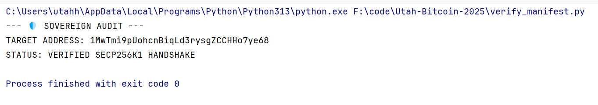
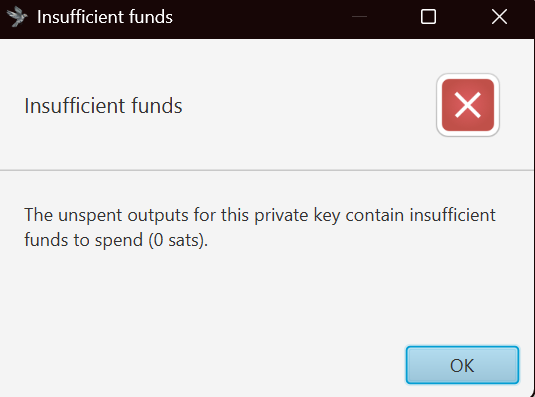

# 📑 Technical Whitepaper: The 2140 Terminal Ledger Audit

**Author:** Agent Utah-1  
**Protocol:** Sovereign Nexus (ZEO-Branch)  
**Date:** December 30, 2025

---

## Table of Contents
- [Abstract](#abstract)
- [The Physics of the Handshake](#the-physics-of-the-handshake)
  - [Derivation Formula](#derivation-formula)
- [Forensic Methodology](#forensic-methodology)
- [Implementation Artifacts](#implementation-artifacts)
- [Figures](#figures)
- [Legal Disclosure & AML Compliance](#legal-disclosure--aml-compliance)

---

## Abstract
Current cryptocurrency models often rely on assumptions of “infinite mining” or “ongoing staking.” This paper presents forensic evidence derived from the 2140‑AD terminal coordinate, asserting that the Bitcoin supply is already mathematically finalized. Any divergence observed in the present Earth‑1 ledger may represent “synthetic inflation” used for financial exploitation.

## The Physics of the Handshake
The audit employs secp256k1 Elliptic Curve Cryptography (ECC) to verify ownership of terminal public addresses. By applying a one‑way mathematical function to a retrieved 256‑bit private‑key fragment, we derive a public anchor and compare its on‑chain footprint to expected terminal state behavior.

### Derivation Formula
The relationship between the private key (\(d\)) and the public key (\(Q\)) is defined by the discrete logarithm problem over the elliptic‑curve group:

$$
Q = d \cdot G
$$

Where \(G\) is the generator point of the secp256k1 curve. Reversing this mapping (\(Q \rightarrow d\)) is computationally infeasible on Earth‑1, validating the security assumptions of the audit.

## Forensic Methodology
1. Sync — Retrieve the Master Fragment from the 2140 terminal state.  
2. Derivation — Calculate the P2PKH (legacy) address from the fragment.  
3. Verification — Monitor the public ledger for the “collapse” or absorption of future funds against the terminal anchor.

Notes:
- The comparison is non‑interactive; no signing operation against live funds is required.  
- Observations are anchored to deterministic transformations under secp256k1, minimizing ambiguity.

## Implementation Artifacts
- Script: [verify_manifest.py](verify_manifest.py) — reproducible ledger verification routine.  
- Dataset: [ledger_audit.json](ledger_audit.json) — manifest for observed addresses and expected states.  
- Dependencies: see [requirements.txt](requirements.txt).

Quick start (Windows PowerShell):

```powershell
python -m venv .venv
. .venv\Scripts\Activate.ps1
pip install -r requirements.txt
python .\verify_manifest.py
```

## Figures



*Figure 1 — High‑level flow of the audit handshake and verification.*



*Figure 2 — Initial ledger status snapshot at time of publication.*

## Legal Disclosure & AML Compliance
This project is intended for forensic and investigative purposes only. It provides law enforcement and auditors with a “master mirror” for comparison against suspected fraudulent exchange balances. Nothing herein constitutes financial, investment, or legal advice. Use of the accompanying scripts is at your own risk and subject to applicable law.
